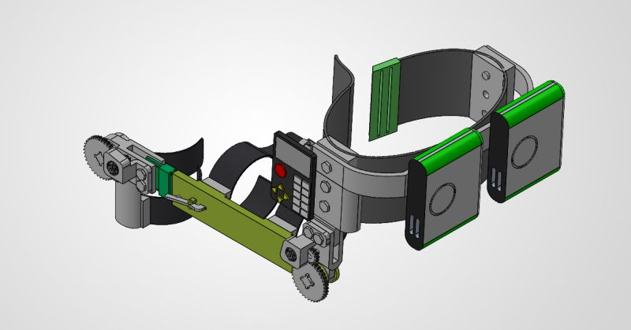
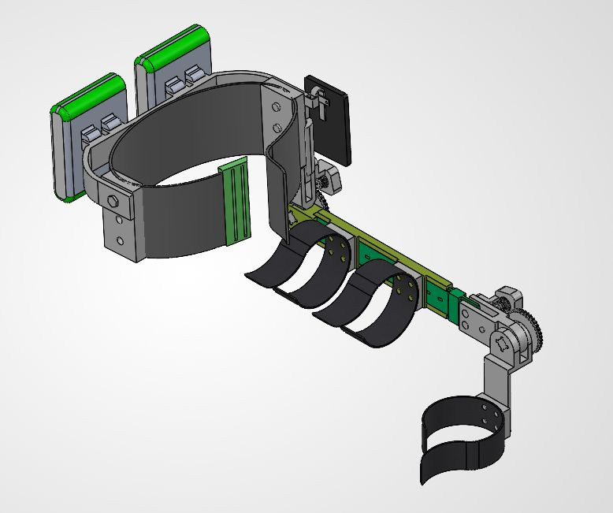
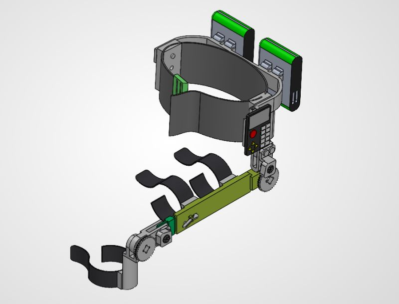

# Mechanical System Design – Academic Project

## Project Overview
This is a final-year academic mechanical engineering project focused on the design and basic analysis of a mechanical system. The project aims to translate engineering requirements into practical and realistic design solutions.

## Objectives
- Apply mechanical engineering fundamentals in a practical design context
- Develop CAD-based system layouts
- Perform basic engineering calculations
- Prepare technical documentation

## Tools & Software
- AutoCAD
- SolidWorks
- Excel

## My Role
- Designed the mechanical system layout
- Performed basic calculations and sizing
- Prepared technical drawings and documentation

## Project Outcome
- Completed a functional design that meets academic and basic engineering requirements

## Notes
This project was completed for academic and educational purposes only.
## Project Images

